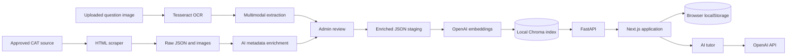

# CAT Prep AI: Repository-Wide Implementation Strategy

## 1. Purpose

This document is the implementation plan for turning the current CAT Prep AI prototype into a secure, testable, deployable product. It covers the complete repository: source extraction, AI enrichment, question validation, embedding and indexing, FastAPI services, the Next.js application, exam sessions, semantic search, the AI tutor, persistence, testing, and operations.

The intended product outcome is a CAT practice platform in which a student can:

1. Create a filtered practice test without breaking DILR/VARC question sets.
2. Take, pause, resume, submit, and review a timed exam.
3. Search the question bank with natural-language or structured filters.
4. Ask a context-aware tutor for concise, Socratic help.
5. See durable performance history and topic-level insights across devices.

An administrator should be able to ingest questions from approved sources, review AI-generated metadata, publish a versioned question bank, and audit ingestion quality and cost.

## 2. Current Repository Snapshot

The repository already contains an end-to-end prototype:

| Area | Current implementation | Main files |
| --- | --- | --- |
| Web application | Next.js 16, React 19, TypeScript, Tailwind CSS, KaTeX | `cat-frontend/app/**` |
| API | Single FastAPI module with extraction, retrieval, search, and tutor endpoints | `api.py`, `main.py` |
| Domain schema | Pydantic models for CAT questions, sets, taxonomy, and enrichment output | `data_models.py` |
| Structured extraction | Tesseract OCR plus a multimodal OpenAI structured-output call | `ingestion.py`, `/api/test-extraction` |
| Web-source extraction | BeautifulSoup scraper that preserves inline images as Markdown | `dev_scripts/extraction/extraction_script.py` |
| Metadata enrichment | OpenAI-generated subject, topic, difficulty, trap, keywords, and image descriptions | `enrich_extracted_cat_papers.py`, `single_batch_enricher.py` |
| Retrieval index | Local persistent Chroma collection using `text-embedding-3-small` | `ingest_extracted_cat_papers.py`, `chroma_db/` |
| Practice engine | Test configuration, timers, MCQ/TITA input, review, autosave, history, and AI tutor | `page.tsx`, `ExamEngine.tsx`, `history/page.tsx`, `AITutor.tsx` |
| Search | Query expansion, Chroma similarity search, question/set viewers | `/api/semantic-search`, `search/**` |
| Local startup | Windows batch and PowerShell scripts | `startApp.bat`, `dev_scripts/*.ps1` |

The checked-in root `README.md` and frontend README do not yet explain this system. This document should become the source for those shorter onboarding guides.

## 3. Current End-to-End Architecture



### 3.1 Content ingestion flow

1. `extraction_script.py` downloads configured source pages, extracts standalone questions or context-bound sets, downloads images, and emits raw JSON.
2. `enrich_extracted_cat_papers.py` sends each batch and its images to the enrichment model. The deterministic source text remains authoritative; the model supplies taxonomy and psychometric metadata.
3. The enrichment step creates stable-looking question payloads, injects image descriptions into `combined_embed_text`, and writes JSON to `chroma_ready_docs/`.
4. `ingest_extracted_cat_papers.py` flattens nested question records, generates embeddings, and writes documents plus metadata to the `cat_questions` Chroma collection.
5. The admin ingestion page provides a second, manual review path for extracted questions and saves approved JSON through `/api/approve`.

### 3.2 Student practice flow

1. The home page loads taxonomy values from Chroma and builds a test configuration.
2. `/test-exam` converts URL parameters to a `/api/generate-test` request.
3. The API retrieves a candidate pool, sorts or shuffles it, and expands any selected set to include all siblings.
4. `ExamEngine` manages answers, time spent, navigation, pause/resume, review, and tutor chat.
5. Exam history, presets, current attempts, and recent searches are stored only in browser storage.

### 3.3 Search and tutor flow

1. Semantic search optionally expands CAT abbreviations with a small language model.
2. Chroma returns nearest questions. Results over a fixed distance threshold are removed, and any matching set is expanded with its siblings.
3. Question and set detail routes reuse `ExamEngine` in review/practice mode.
4. The tutor receives the full question JSON, conversation history, and locally resolved question images before calling the selected model.

## 4. Key Gaps to Resolve First

These are implementation blockers, not optional cleanup.

### 4.1 Security and configuration

- A live-looking OpenAI credential is present in a local setup script. Rotate it immediately, remove it from every reachable Git revision, and use environment injection or a secret manager. Never include a replacement key in source control.
- `ingestion.py` disables TLS certificate verification. Restore certificate validation and fix the local trust store instead of bypassing transport security.
- FastAPI currently permits every CORS origin while allowing credentials. Configure an explicit origin list per environment.
- The API exposes administrative ingestion and database-debug endpoints without authentication or authorization.
- The tutor can return raw exception details to the browser. Map internal failures to stable public error codes and log details server-side.

### 4.2 Reproducibility and repository hygiene

- Python dependencies are unpinned, `openai` is duplicated, and the setup script recreates the virtual environment on every launch.
- The root `.gitignore` pattern `lib/` ignores the required `cat-frontend/app/lib/api.ts` file, even though `/test-exam` imports it. Anchor language-specific ignore patterns or explicitly unignore application source.
- Generated databases, archives, caches, extracted assets, and virtual environments exist beside source code. Define which sample data is intentionally versioned; move all other artifacts to ignored runtime directories or external storage.
- Startup is Windows-specific, assumes a fixed Tesseract path, rewrites the API key placeholder, and uses a time delay instead of health checks.
- Application paths depend on the current working directory. One image output path also traverses above the repository root. All paths should derive from validated settings and `Path(__file__)`.

### 4.3 Contract and behavior drift

- `data_models.py` and `api.py` define separate test-generation request models.
- The UI sends multiple topics and subtopics as comma-separated strings, but the backend applies a single equality filter. Trap type and calculation intensity are sent by the UI but are absent from `TestGenRequest`, so they are ignored.
- Difficulty categories use `7.0` as the hard boundary in Pydantic and `7.5` in the frontend.
- The single-batch enricher reads `metadata_payload.questions`, while `LLMBatchEnrichment` exposes `question_metadata_list`.
- Flattening and reconstructing question records is repeated in several endpoints, making response fields inconsistent.
- Set order is inferred from random IDs. Question/set ordering needs an explicit `source_order` or `question_number` field.
- Some frontend calls use `NEXT_PUBLIC_API_URL`, some use the Next.js rewrite, and others hard-code `localhost` or `127.0.0.1`.

### 4.4 Product durability

- User history and active attempts are local to one browser and can be lost or edited.
- Correct answers and solutions are delivered with the test payload before submission, which makes answer leakage trivial.
- There is no user identity, server-owned attempt lifecycle, audit history, or admin role.
- There is no automated test suite in source; the `tests/` directory contains only a compiled cache artifact.
- The local Chroma database is acting as both the canonical question store and the search index. It should be a rebuildable derived index.

## 5. Target Architecture

Keep the system as a modular monolith until usage proves a need for separate services. This minimizes operational cost while establishing clean boundaries.

```mermaid
flowchart LR
    Admin[Admin UI] --> API[FastAPI modular API]
    Student[Next.js student UI] --> API
    API --> DB[(PostgreSQL canonical data)]
    API --> Vector[(Chroma or managed vector index)]
    API --> Objects[(Object storage)]
    API --> Queue[Background job queue]
    Queue --> Pipeline[Extraction / enrichment / embedding workers]
    Pipeline --> OpenAI[OpenAI API]
    Pipeline --> DB
    Pipeline --> Vector
    API --> OpenAI
    API --> Telemetry[Logs, metrics, traces, cost events]
```



### 5.1 Component responsibilities

| Component | Responsibility |
| --- | --- |
| Next.js | Student/admin presentation, accessibility, client interaction, and a single typed API client |
| FastAPI routers | HTTP validation, authentication, authorization, orchestration, and stable response envelopes |
| Domain services | Test assembly, scoring, set expansion, search policy, tutor policy, and ingestion state transitions |
| PostgreSQL | Canonical questions, contexts, sources, versions, users, attempts, answers, chats, and ingestion jobs |
| Vector index | Rebuildable semantic retrieval index keyed by canonical question/version IDs |
| Object storage | Source HTML snapshots, question images, and other immutable ingestion artifacts |
| Worker | Retryable OCR, enrichment, validation, and embedding work outside request/response latency |
| Telemetry | Request IDs, job status, latency, model/token cost, retrieval quality, and failure diagnostics |

SQLite can be used during early local development, but schemas and migrations should target PostgreSQL behavior. Chroma may remain the first vector implementation if it is accessed only through a repository interface.

## 6. Proposed Source Layout

Refactor incrementally; do not stop feature delivery for a one-shot rewrite.

```text
backend/
  app/
    main.py
    config.py
    api/
      dependencies.py
      routers/
        health.py
        questions.py
        tests.py
        search.py
        tutor.py
        ingestion.py
    domain/
      models.py
      scoring.py
      test_assembly.py
      search_policy.py
    services/
      question_service.py
      attempt_service.py
      tutor_service.py
      ingestion_service.py
    repositories/
      questions.py
      attempts.py
      vector_index.py
    integrations/
      openai_client.py
      object_store.py
      ocr.py
    workers/
      ingestion_jobs.py
  tests/
cat-frontend/
  app/
  components/
  features/
    test-builder/
    exam/
    history/
    search/
    tutor/
    ingestion/
  lib/
    api-client.ts
    config.ts
    storage.ts
  types/
scripts/
  ingest/
  maintenance/
docs/
```

The first refactor should move code without changing endpoint behavior. Add characterization tests before extracting each service.

## 7. Phased Implementation Plan

### Phase 0: Secure and make the repository reproducible

Goal: every developer and CI runner can safely start the same application.

Implementation:

1. Rotate and remove exposed credentials; add `.env.example` containing names only.
2. Introduce a Pydantic settings object for API host, CORS origins, storage paths, Tesseract command, OpenAI models, embedding model, and feature flags.
3. Restore TLS verification and fail startup with a useful message when required configuration is absent.
4. Pin Python versions and dependencies with a lockable tool; remove duplicates. Retain `package-lock.json` and declare the supported Node version.
5. Fix `.gitignore` so application `lib` source is tracked. Remove generated artifacts from future commits and document how to rebuild them.
6. Replace repeated setup-on-start with separate `setup`, `dev`, `test`, and `build` commands. Provide equivalent PowerShell and platform-neutral commands.
7. Add `/health/live` and `/health/ready`; readiness checks database, vector collection, and required configuration without making a paid model call.
8. Update the root README with prerequisites, environment variables, setup, run, test, ingestion, and troubleshooting instructions.

Acceptance criteria:

- A fresh clone starts from documented commands without editing source files.
- No secret scanner finds a credential in the current tree or reachable shared history.
- Frontend lint/type-check and backend import checks run in CI.
- Health checks accurately distinguish process health from dependency readiness.

### Phase 1: Establish canonical contracts and modular boundaries

Goal: one definition of a question and one implementation of each business rule.

Implementation:

1. Define canonical Pydantic models for `Question`, `QuestionSet`, `ParentContext`, `QuestionMetadata`, `Source`, and API request/response envelopes.
2. Add `schema_version`, `content_version`, `source_order`, `publication_status`, and timestamps.
3. Use one difficulty mapping (`Easy` 1.0–3.9, `Medium` 4.0–6.9, `Hard` 7.0–10.0) in both backend and frontend.
4. Replace comma-separated filter strings with arrays. Add backend support for topic, subtopic, trap, calculation intensity, question type, and numeric difficulty filters.
5. Extract one question serializer/deserializer used by generate-test, structured search, semantic search, question detail, and set detail.
6. Generate or validate frontend TypeScript types from the FastAPI OpenAPI schema. Remove `any` from API boundaries.
7. Split `api.py` into routers, domain services, repositories, and integrations while keeping existing URLs temporarily compatible.
8. Add an API version prefix such as `/api/v1`; keep forwarding routes for one release before removal.

Acceptance criteria:

- Every visible test-builder filter changes the backend query and has an integration test.
- The same question has the same shape from every read endpoint.
- Set order is deterministic and independent of UUID ordering.
- OpenAPI validation and frontend type-checks fail CI on contract drift.

### Phase 2: Make ingestion a reliable, auditable pipeline

Goal: content moves through explicit states and can be retried without duplication.

Implementation:

1. Model ingestion as `discovered -> fetched -> extracted -> enriched -> needs_review -> approved -> indexed -> published`, with `failed` and retry metadata.
2. Preserve immutable source snapshots and record source URL, source item ID, fetch time, checksum, parser version, and licensing/usage status.
3. Derive deterministic question IDs from source identity and source question number; use separate version IDs when content changes.
4. Separate deterministic extraction from probabilistic enrichment. AI may add classifications and descriptions but must not silently rewrite source question text, choices, answers, or solutions.
5. Validate every batch with the canonical schema and cross-field rules: unique IDs, exactly one parent context for a set, valid answers, complete MCQ options, and aligned difficulty fields.
6. Store model name, prompt version, token usage, cost, latency, and raw structured response for every enrichment job.
7. Replace per-file scripts with a shared pipeline library and thin CLI commands such as `ingest fetch`, `ingest extract`, `ingest enrich`, `ingest review`, and `ingest index`.
8. Make indexing idempotent with upsert, content hashes, `embedding_model`, and `embedding_version`. Support full rebuild into a new collection followed by an atomic alias switch.
9. Expand the admin UI into a review queue with source-vs-enriched diff, image preview, schema errors, approve/reject/edit actions, and batch progress.
10. Enforce admin authorization and CSRF-safe mutations. Keep debug and maintenance endpoints unavailable in production.

Acceptance criteria:

- Rerunning any job produces no duplicate canonical question or vector record.
- A failed batch can resume from its failed stage.
- Every published question is traceable to a source snapshot and reviewer decision.
- A vector index can be deleted and rebuilt entirely from canonical records.

### Phase 3: Correct retrieval, test generation, and search

Goal: return relevant questions while preserving CAT set semantics and requested constraints.

Implementation:

1. Introduce a `QuestionRepository` for structured queries and a `VectorIndex` interface for semantic queries.
2. Define test assembly rules explicitly:
   - apply all selected filters;
   - choose a candidate question or context group;
   - expand a selected set as one atomic group;
   - define whether `limit` is a hard question count or a target that may be exceeded by a complete set;
   - prevent duplicate questions and recently seen questions when requested;
   - use a seeded random value when reproducibility is required.
3. Return an assembly explanation containing requested count, actual count, applied filters, expanded set IDs, and warnings about relaxed constraints.
4. Replace a universal semantic-distance cutoff with an evaluated per-index policy. Record query, rank, distance, clicked result, and practice conversion without storing unnecessary personal text.
5. Implement hybrid retrieval: metadata filters first, vector similarity second, optional keyword/full-text score, then a deterministic reranker.
6. Expand abbreviations with a deterministic CAT synonym dictionary before using a model. Cache safe model expansions and allow search to continue if expansion fails.
7. Add pagination/cursors and cap set expansion to validated canonical groups.
8. Prevent answer leakage: test-delivery responses omit answers and solutions; review responses expose them only after server-confirmed submission or explicit practice reveal.

Acceptance criteria:

- Contract tests cover standalone MCQ, standalone TITA, RC set, DILR set, empty results, and conflicting filters.
- No generated test contains a partial set unless the product mode explicitly permits it.
- Identical seeded requests produce identical question order.
- Search quality has a small labelled evaluation set with tracked Recall@K/MRR or equivalent metrics.

### Phase 4: Harden the frontend and exam experience

Goal: make student workflows typed, accessible, recoverable, and consistent across environments.

Implementation:

1. Route every call through one tracked `api-client.ts` using relative `/api` URLs or one validated base URL. Add timeouts, abort signals, normalized errors, and request IDs.
2. Organize the large `ExamEngine` into an exam state reducer plus focused components for context, question, answer input, palette, timer, tutor panel, exit dialog, and review summary.
3. Represent attempt lifecycle as a state machine: `loading`, `in_progress`, `paused`, `submitting`, `submitted`, and `reviewing`.
4. Move scoring to the backend. Use the CAT rule currently represented by the UI (+3 correct, -1 wrong MCQ, no TITA penalty) as a versioned scoring policy.
5. Autosave debounced answer/time deltas to the server. Keep local storage only as an offline recovery cache with a schema version and expiry.
6. Resolve multi-select filtering as arrays end to end. Show when set expansion changes the requested question count.
7. Consolidate difficulty labels, math rendering, image resolution, source links, and loading/error/empty states into shared components.
8. Meet keyboard and screen-reader requirements: focus management, labelled inputs, non-color-only answer states, timer announcements, and accessible dialogs.
9. Add error boundaries and a recovery experience for failed test generation or submission.
10. Keep recent searches and presets server-backed for signed-in users, with local fallback for anonymous users.

Acceptance criteria:

- Refreshing or changing devices does not lose a signed-in active attempt.
- Double-clicking submit cannot create multiple submissions.
- All primary workflows pass automated accessibility checks and keyboard smoke tests.
- Production builds contain no hard-coded localhost API calls.

### Phase 5: Add durable users, attempts, and analytics

Goal: make progress history trustworthy and useful.

Start with these core tables or equivalent models:

| Model | Essential fields |
| --- | --- |
| `users` | identity provider ID, display settings, created time |
| `questions` | stable ID, current version, subject, type, publication status |
| `question_versions` | source text, options, answer, solution, taxonomy, metadata, schema version |
| `contexts` | stable set ID, type, body, source order, version |
| `sources` | URL, label, rights status, checksum, fetched time |
| `test_blueprints` | filters, requested count, timer/scoring policy, random seed |
| `attempts` | user, blueprint, status, start/pause/submit times, score |
| `attempt_questions` | frozen question-version ID and display order |
| `answers` | selected/input answer, correctness, time spent, revision count |
| `tutor_threads` | user, attempt question, model/prompt version, created time |
| `ingestion_jobs` | source, stage, status, retry count, cost, diagnostics |

Implementation:

1. Add migrations and transactional repositories.
2. Integrate a standards-based identity provider; use server-side sessions or verified tokens.
3. Enforce ownership on attempts, history, chats, and presets; enforce roles on ingestion.
4. Freeze question versions within an attempt so later content edits do not change historical scores.
5. Calculate section/topic/subtopic accuracy, attempt rate, average time, difficulty performance, and trap-type performance from server records.
6. Add retention and deletion controls for user data and tutor conversations.

Acceptance criteria:

- Attempt state changes are transactional and auditable.
- Historical review uses the exact question version originally attempted.
- A user can export or delete their personal data according to the documented policy.

### Phase 6: Productize the AI tutor

Goal: provide useful help with controlled cost, latency, and answer leakage.

Implementation:

1. Put model selection, allowlists, timeouts, retries, and prompts behind a tutor service rather than accepting arbitrary client behavior.
2. Send only the required question/context fields and relevant recent turns; do not repeatedly serialize unrelated metadata or official solutions before reveal policy permits it.
3. Version the Socratic prompt and add response constraints, content moderation where appropriate, and explicit handling for ambiguous or malformed questions.
4. Resolve images through object storage IDs rather than arbitrary paths. Validate MIME type, size, and ownership before encoding or issuing signed URLs.
5. Stream responses, support cancellation, and persist completed turns with token/cost metadata.
6. Add per-user and per-IP rate limits, daily budgets, concurrency limits, and graceful quota messages.
7. Build a tutor evaluation set that checks factual grounding, math correctness, brevity, Socratic behavior, and premature answer disclosure.

Acceptance criteria:

- Tutor requests cannot read arbitrary local files or select unapproved models.
- Cost and latency are visible per request and aggregated by model/prompt version.
- Regression evaluations pass before changing a production prompt or model.

### Phase 7: Testing, observability, and deployment

Goal: ship changes safely and operate the product with evidence.

Implementation:

1. Add CI stages for secret scanning, Python lint/type-check, backend tests, frontend lint/type-check/unit tests, production build, and browser smoke tests.
2. Use unit tests for scoring, difficulty mapping, flatten/unflatten, set expansion, filters, and query normalization.
3. Use API integration tests with temporary SQL and vector repositories; mock paid model calls with recorded schema-valid fixtures.
4. Use component tests for the builder, exam reducer, MCQ/TITA input, timer, autosave, and history calculations.
5. Use Playwright for create-test, take/pause/resume/submit/review, search/open set, tutor error recovery, and admin review.
6. Add structured JSON logs with environment, request ID, user/job ID hashes, route, latency, status, and error code. Never log secrets, full authorization headers, or unnecessary question/chat bodies.
7. Track API latency/error rate, vector latency, empty-result rate, set-expansion rate, ingestion throughput/failure, model tokens/cost, tutor latency, attempt completion, and autosave failures.
8. Containerize frontend, API, and worker. Run migrations as a controlled release step and add backup/restore drills for canonical data.
9. Create `local`, `test`, `staging`, and `production` configurations. Use managed secret injection and separate databases/indexes/buckets for each environment.
10. Deploy with readiness checks, rolling or blue/green rollout, backward-compatible migrations, and documented rollback steps.

Acceptance criteria:

- Pull requests cannot merge when required quality or security checks fail.
- Staging can run the full ingestion-to-practice smoke flow without production data.
- Dashboards and alerts identify user-visible failures before manual log inspection.
- Restore and rollback procedures are tested, not merely documented.

## 8. API Strategy

Preserve existing routes during the refactor, then converge on resource-oriented versioned endpoints.

| Capability | Current route | Target direction |
| --- | --- | --- |
| Health | None | `GET /health/live`, `GET /health/ready` |
| Taxonomy | `GET /api/taxonomy` | `GET /api/v1/taxonomy?subject=...` |
| Test generation | `POST /api/generate-test` | `POST /api/v1/test-blueprints` followed by attempt creation |
| Attempt state | Browser-only | `POST /api/v1/attempts`, `PATCH /attempts/{id}`, `POST /attempts/{id}/submit` |
| Structured search | `POST /api/search` | `POST /api/v1/questions/search` |
| Semantic search | `POST /api/semantic-search` | One search endpoint with `mode`, filters, cursor, and result rationale |
| Question/set read | `GET /api/question/{id}`, `GET /api/set/{id}` | Versioned question/context resources with reveal policy |
| Tutor | `POST /api/chat` | `POST /api/v1/tutor/threads/{id}/messages`, preferably streamed |
| Image extraction | `POST /api/test-extraction` | Admin-only ingestion job creation |
| Review approval | `POST /api/approve` | Admin-only review decision on a staged content version |
| Debug database | `GET /api/debug-db` | Remove from production; replace with protected readiness/metrics |

All error responses should use a stable envelope such as `code`, `message`, `request_id`, and optional field-level `details`. Avoid returning stack traces, filesystem paths, or provider errors.

## 9. Data and Indexing Rules

1. PostgreSQL is authoritative; the vector index is disposable and rebuildable.
2. Every vector record points to a specific published question version.
3. Parent context is stored once canonically, not duplicated as mutable text on every sibling.
4. An attempt stores frozen question version IDs and order.
5. Source order is explicit for both contexts and questions.
6. Question text remains verbatim from the approved source; normalized text and image descriptions live in separate search fields.
7. Embedding input construction is a versioned pure function with golden tests.
8. Re-embedding writes to a new index version and never partially mixes incompatible models.
9. Deleting/unpublishing a question removes it from new retrieval while retaining referential integrity for historical attempts.
10. Store only content for which the project has a documented right or permission to use.

## 10. Testing Pyramid and Required Fixtures

Maintain a small, license-safe fixture bank containing:

- one standalone Quant MCQ;
- one standalone TITA question;
- one RC passage with at least three questions;
- one DILR set containing a table or image;
- malformed MCQ options;
- missing solution/answer data;
- duplicated source IDs;
- low-, borderline-, and high-difficulty values;
- semantic queries for abbreviation, literal noun, topic, and no-result cases.

Paid AI calls must not run in the default unit or pull-request suite. Provider contract tests can run on a schedule or by explicit approval with a strict budget.

Suggested quality gates:

| Gate | Initial target |
| --- | --- |
| Backend unit/integration coverage | At least 80% on domain and service modules |
| Frontend unit coverage | At least 70% on reducers, API client, and scoring/display logic |
| Type safety | No unapproved `any` at API boundaries; strict TypeScript |
| Accessibility | No critical automated violations on primary routes |
| Search evaluation | No regression beyond the agreed tolerance on labelled queries |
| Ingestion validation | 100% of published records pass schema and referential checks |
| Secret scanning | Zero verified credentials |

Coverage numbers are guardrails, not substitutes for behavior-focused tests.

## 11. Delivery Sequence

The safest delivery order is:

1. **Foundation release:** Phase 0 plus characterization tests around current endpoints.
2. **Contract release:** canonical schemas, complete filters, shared serializer, typed client, and deterministic set order.
3. **Content release:** auditable/idempotent ingestion and a protected review queue.
4. **Attempt release:** authentication, server-owned attempts, answer reveal controls, and durable history.
5. **Retrieval release:** evaluated hybrid search, deterministic test assembly, and index versioning.
6. **Tutor release:** streamed, budgeted, evaluated tutoring with secure image handling.
7. **Production release:** full CI/CD, observability, backups, rollback, and operational runbooks.

Each release should use backward-compatible API/database changes, migrate existing data, observe production behavior, and only then delete obsolete paths.

## 12. Definition of Done

The repository-wide strategy is complete when:

- setup, development, testing, ingestion, and deployment are documented and reproducible;
- no secret or machine-specific absolute path is required in source;
- canonical, versioned data is stored outside the vector index;
- ingestion is idempotent, reviewed, auditable, and rebuilds the index safely;
- all test-builder filters work exactly as presented;
- sets are always ordered and assembled according to an explicit policy;
- answers cannot be retrieved before the configured reveal point;
- attempts and history survive refreshes and device changes;
- semantic search and tutor behavior are measured with regression evaluations;
- admin routes are authenticated and authorized;
- CI covers security, types, tests, builds, and browser smoke flows;
- production has health checks, telemetry, backups, restore drills, and rollback instructions.

## 13. Decisions Required Before Phase 5

The following choices do not block foundation work, but should be recorded before durable persistence is implemented:

1. Identity provider and anonymous-user policy.
2. PostgreSQL host and migration tooling.
3. Local Chroma versus a managed production vector store.
4. Object-storage provider and image retention policy.
5. Job-queue technology and worker hosting model.
6. Content licensing and source-retention rules.
7. Whether a completed set may exceed a requested test question limit.
8. Tutor answer-reveal policy for live attempts versus review mode.
9. Data retention, export, deletion, and regional privacy requirements.
10. Initial deployment platform, environments, budget, and service-level objectives.

These decisions should be captured as short architecture decision records under `docs/decisions/` so future changes preserve the reasoning behind them.
